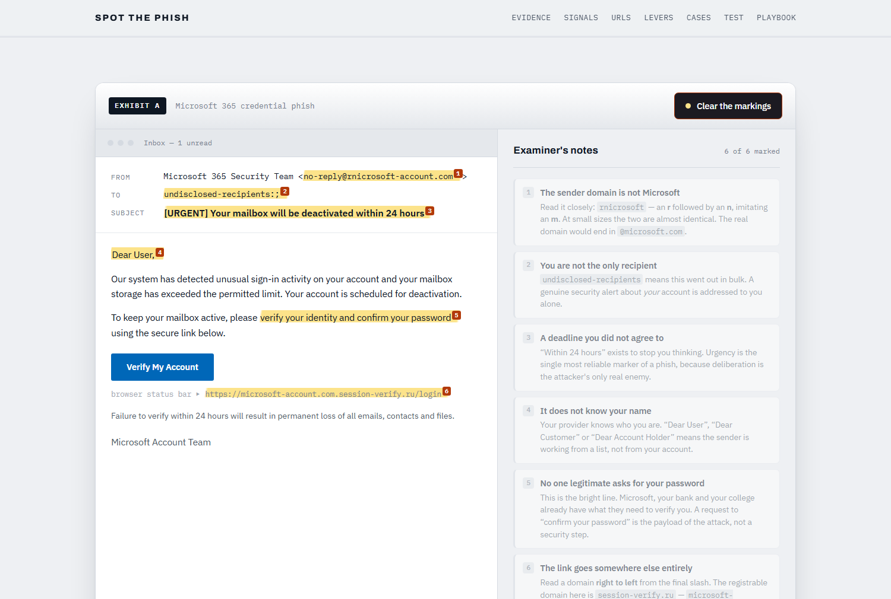

# Spot the Phish — Phishing Awareness Training

<div align="center">

### ▶&nbsp; [**TRY THE LIVE MODULE**](https://likith2005-coder.github.io/CodeAlpha_PhishingAwareness/) &nbsp;◀

<a href="https://likith2005-coder.github.io/CodeAlpha_PhishingAwareness/">
  
</a>

<br><br>

<a href="https://likith2005-coder.github.io/CodeAlpha_PhishingAwareness/">
  
</a>

<sub>Exhibit A with all six red flags marked · <a href="https://likith2005-coder.github.io/CodeAlpha_PhishingAwareness/"><b>open it and mark them yourself →</b></a></sub>

</div>

> [!TIP]
> **Runs in your browser — nothing to install, no build step.**
> **https://likith2005-coder.github.io/CodeAlpha_PhishingAwareness/**

---

An interactive phishing awareness module, built for the **CodeAlpha Cyber
Security Internship (Task 2)**.

Rather than a slide deck, this is a self-contained web module you work
*through*: you mark up a real-style phishing email yourself, take apart the
addresses used by fake websites, and then get tested on eight situations that
happen constantly.

> **Task requirements covered**
> - [x] Create a presentation or online module focused on phishing attacks
> - [x] Explain how to recognise phishing emails **and fake websites**
> - [x] Educate about social engineering tactics used by attackers
> - [x] Provide best practices and tips to avoid falling victim
> - [x] Include real-world examples **and interactive quizzes**

---

## Run it

**Easiest — just open the hosted version:**
### 🔗 https://likith2005-coder.github.io/CodeAlpha_PhishingAwareness/

**Or run it locally.** No build step, no dependencies, no server:

```bash
git clone <repository-url>
cd CodeAlpha_PhishingAwareness
```

Then open `index.html` in any browser — double-clicking the file works.

---

## What's inside

**1 · Exhibit A — mark up the email**
A realistic Microsoft 365 credential phish, rendered as an actual email client.
Six deceptive details are hidden in it. Click any fragment to mark it and read
the examiner's note, or reveal all six at once. This is the core exercise:
recognition is a skill you practise, not a list you read.

**2 · The six signals**
The questions worth asking about any message, in about ten seconds — without
inspecting headers or reading source.

**3 · Read the address right to left**
An interactive dissector for five specimen URLs. Each one is broken into
labelled segments with the **registrable domain** highlighted, because that
single habit — finding the real domain — defeats most fake-website attacks:

| Specimen | The trick |
|---|---|
| `microsoft-account.com.session-verify.ru` | Trusted name demoted to a subdomain |
| `rnicrosoft.com` | `rn` imitating `m` — a homoglyph |
| `аpple.com` | Cyrillic `а`, stored as `xn--pple-43d.com` |
| `sbi-online.co` | Familiar name, wrong ending |
| `login.microsoft.com` | The genuine article, for contrast |

Plus the single most common misconception: the padlock means the connection is
encrypted, not that the site is honest.

**4 · The levers being pulled on you**
Authority, urgency, fear, curiosity, familiarity and reciprocity — with the
line each one actually sounds like. Then the same attack on other channels:
spear phishing, whaling, smishing, vishing, quishing and BEC.

**5 · Documented incidents**
Four public-record cases: Google & Facebook (≈$100M invoice fraud), Ubiquiti
($46.7M BEC), Twitter (July 2020 phone spear phishing), and Target (2013, via
a refrigeration contractor). Figures come from court records, SEC filings and
company statements.

**6 · Eight judgement calls**
A scored quiz. Every answer — right or wrong — explains the reasoning, because
the reasoning is the part that transfers. The final score gives targeted advice
rather than a grade.

**7 · Playbook**
Habits worth building, and a numbered procedure for the worst moment: *what to
do once you have already clicked*, including the India-specific route
(cybercrime.gov.in, helpline 1930) where the first hours decide whether funds
can be frozen.

---

## Design notes

Security material usually defaults to a dark "cyber" aesthetic — glowing
terminals, shields, matrix green. That is the wrong metaphor here, because
phishing does not look like that. It arrives inside completely ordinary
surfaces: an inbox row, an address bar, a login form.

So the module is built as a **forensic examination desk**. A cool paper
workspace, real interface chrome reproduced faithfully, and a highlighter swipe
as the recurring motif — the mark an examiner leaves on evidence. The one place
boldness is spent is that yellow mark; everything else stays quiet.

- **Type**: Archivo for display, IBM Plex Sans for body, IBM Plex Mono for
  anything that is evidence — addresses, headers, URLs. Monospace is used to
  signal "this is a specimen, read it literally".
- **Colour**: ink navy on cool grey, burnt orange for caution markings rather
  than alarm red, deep teal for the verified state.
- **Accessibility**: keyboard focus is visible throughout, every interactive
  element is a real `<button>`, quiz feedback is announced via `aria-live`,
  `prefers-reduced-motion` is respected, and there is a skip link.
- **Responsive**: verified at a 375px viewport with zero horizontal overflow.

---

## Project layout

```
CodeAlpha_PhishingAwareness/
├── index.html    # structure and all training content
├── styles.css    # design tokens and layout
├── app.js        # the three interactions, no dependencies
├── LICENSE       # MIT
└── README.md
```

`app.js` holds three independent widgets — the evidence markup, the URL
dissector and the quiz. Quiz questions and URL specimens are plain data
structures at the top of their sections, so the module can be extended by
editing arrays rather than markup.

---

## A note on the sample content

Every email, address and phone number in this module is **fabricated for
training**. `rnicrosoft-account.com` and `session-verify.ru` are illustrations,
not live sites, and nothing here links out to a real destination. The incident
figures in section 5 are real and publicly documented.

The material is written for defensive awareness training. It teaches
recognition — how to read a sender, a domain and a request — and deliberately
contains no tooling for conducting an attack.

---

## What I learned

- The technical tells are the easy half. The reliable one is **the request
  itself**: a message asking for a password, a payment or an OTP is suspect no
  matter how clean its headers are — which is why BEC works from genuine,
  compromised accounts and defeats every sender check.
- Reading a domain **right to left** is the single highest-value habit, and
  almost nobody is taught it. Everything left of the registrable domain is free
  text chosen by the attacker.
- HTTPS reassurance is now actively harmful. "Look for the padlock" was
  reasonable advice when certificates were expensive; it is misleading now that
  they are free and automated.
- Awareness training fails when it produces guilt, because the control that
  matters most — reporting fast — is the one shame suppresses. That is why the
  playbook opens with *do not hide it*.

---

## Author

Built for the **CodeAlpha Cyber Security Internship** — Task 2: Phishing
Awareness Training.
